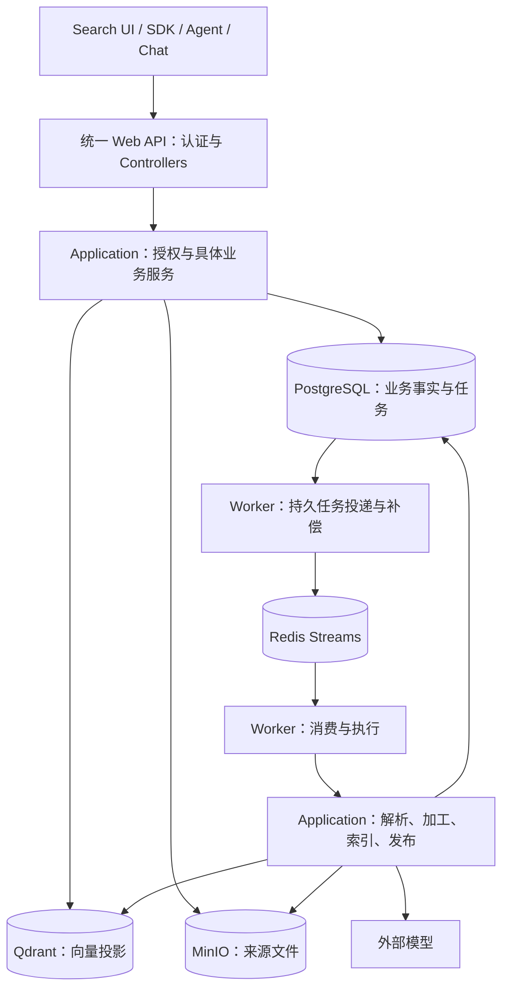

# Enterprise Knowledge Platform
## 通用企业知识库平台 API 总体设计

> 状态：架构评审修订稿，待关键决策确认；不是已实现功能清单。
> 修订日期：2026-09-12。范围：只修订本文件，不修改代码、数据库、部署或其他文档。
> 约束依据：`Agent.md`、`claude.md`、`docs/plans/2026-09-07-tigerrag-overview-design.md` 及现有设计计划。新增建议不自动覆盖仓库约束。

# 0. 审核结论与修改记录

原稿正确区分了知识能力与 Agent 决策，强调来源追溯、混合检索和统一权限，产品方向合理。但主要是概念和能力清单，缺少数据不变量、接口契约、失败处理和验收门槛，尚不能直接指导实现。

下表的位置指修订前原稿章节。P0 表示相关实现前必须解决；P1 表示对应能力发布前必须完成；P2 表示可维护性改进。

| 优先级 | 原稿问题与位置 | 影响 | 本稿处理 |
| --- | --- | --- | --- |
| P0 | 第 11、15、18 章：未定义授权信任边界，请求含 permission_context | 可能接受伪造范围；详情、证据、图路径仍可能泄漏 | 第 6 章：服务端身份、统一授权、派生属性过滤、撤权语义 |
| P0 | 第 25、37、45 章：入库要求异步，但任务、权限、版本后置 | MVP 无法可靠运行或撤销访问 | 第 3、7、8、23 章：前置安全和生命周期闭环 |
| P0 | 第 12、24、25、28 章：没有多存储一致性、幂等和发布规则 | 丢任务、重复加工、新旧混用、删除后复活 | 第 7、8、16 章：持久投递、发布屏障、删除屏障和对账 |
| P0 | 第 5—12、30、32 章：资源、证据、查询结果和版本混用 | 查询评分被当事实；引用漂移；共享关系被误删 | 第 5、7、14 章：不可变版本、来源断言、查询视图区分 |
| P0 | 第 28、29、39 章：技术与目录建议不对齐仓库 | 引入 pgvector、Neo4j 及过度抽象，扩大维护面 | 第 2、4、21 章：沿用模块化单体、Qdrant 和聚焦 DAL |
| P1 | 第 15—20、24、30、36 章：接口仅列名称/字段 | SDK、错误处理、重试和分页无法统一 | 第 11—14、20 章：协议、资源矩阵、JSON 示例 |
| P1 | 第 17、18 章：图预算只由调用方控制，融合分数未定义 | 资源耗尽、排名失真 | 第 9、10 章：服务端上限、RRF、方向、降级和截断 |
| P1 | 第 7、8、27 章：缺少抽取审核、消歧和配置版本 | 错误合并、无来源关系进入正式知识 | 第 5、15 章：来源断言、审核和模型版本 |
| P1 | 第 24、33 章：接入/审计安全边界不完整 | SSRF、恶意文件、查询/凭据泄漏 | 第 17、18 章：输入、出站、取证和保留规则 |
| P1 | 第 34—38、46 章：有指标名，无规模、恢复和验收方法 | 无法判定“稳定”“可用”或是否需要图数据库 | 第 19、21、23 章：容量候选值、评估与演练门槛 |
| P2 | 第 21—23、40—44 章：重复阐述平台与 Agent 边界 | 篇幅长，关键决策不易定位 | 合并为第 1、20 章 |

本文给出建议设计；容量、业务政策和兼容决策尚未确认的内容集中在第 22 章，不视为已批准需求。

# 1. 产品定位与兼容边界

Enterprise Knowledge Platform 为企业内部 Search、RAG、Agent、Copilot 和业务应用提供文档接入、知识加工、文本与关系检索、来源证据、资源授权及审计。

平台负责单次检索内的确定性执行：权限过滤、召回、去重、融合、可选重排、预算控制和证据组装。调用者选择工具/参数，决定是否继续检索、如何推理、如何生成最终回答及执行业务动作。固定检索策略属于平台职责，不能因使用模型或多路召回就全部归为 Agent 决策。

Embedding、Reranker、实体/关系抽取是平台可用的模型能力；最终回答、会话规划和外部业务操作不属于知识核心。连接器读取外部文档属于接入，不属于 Agent 执行业务动作。

现有 TigerRAG 概要设计包含 Chat、Conversation、Message 和 SignalR。本稿建议将这些视为知识能力的应用消费者，仍可在同一个 Web API 部署内；不得据此删除现有模块或新增微服务。旧问答 API 的迁移、废弃及兼容周期需另行决定。

平台返回带来源的记录和证据，不保证抽取关系等同于现实真相，也不把可达路径自动解释为因果或业务影响。

# 2. 总体架构与方案取舍

## 2.1 部署边界

保持一个 ASP.NET Core Web API、一个 .NET Worker、一个 React 管理站点。业务 HTTP 入口使用 Controllers。



图表示运行时职责，所有基础设施访问经 Application 端口和 Infrastructure 实现，不表示业务层直接引用 SDK。投递器与消费者属于同一个 Worker 程序，不增加部署单元。Redis 不是最终权限判据。

## 2.2 存储选择

| 方案 | 收益 | 代价/适用条件 | 本稿建议 |
| --- | --- | --- | --- |
| PostgreSQL + Qdrant + Redis + MinIO；关系先存 PostgreSQL | 沿用仓库，元数据/权限/关系可事务化 | 复杂图查询需有界执行和规模验证 | V1 基线 |
| PostgreSQL + pgvector + Redis + MinIO | 新部署可能减少向量依赖 | 本仓库需迁移 Qdrant 并重验性能 | 保留替代记录，本次不采用 |
| 基线上增加专用图数据库 | 可能适合大规模复杂遍历 | 新增投影一致性、权限、备份及运维成本 | 压测证明必要且有业务需求后评审 |

Vector、Keyword、Entity、Graph 是四类逻辑索引，不要求四套数据库。PostgreSQL 负责全文/精确字段、实体别名和关系；Qdrant 负责向量。底层替换必须保持 API 语义并重新验证，不能承诺换 SDK 就完成兼容。

# 3. 交付阶段与首版范围

推荐先完成可靠文本检索闭环，再交付图谱增强。一次覆盖所有能力虽范围广，但同时承担抽取质量、图权限和一致性风险，不作为首次可用交付方案。

| 阶段 | 必须包含 | 不纳入该阶段 | 退出条件 |
| --- | --- | --- | --- |
| Phase 0 | 权限矩阵、版本模型、协议、容量假设、验收集和决策冻结 | 生产功能实现 | 第 22 章相关阻断项明确 |
| V1-A 基础闭环 | Collection、认证/ACL、版本/Chunk/Text Evidence、上传/文本、可靠任务、向量/关键词/混合检索、更新/删除、审计/恢复、最小 SDK | 自动图谱、复杂连接器 | 第 23 章 A 类门槛通过 |
| V1-B 完整首版 | Entity/Mention、Relation/Assertion、图证据、受限邻居/路径、抽取审核、最小人工纠错 | 跨库融合、任意图查询语言 | A 门槛保持，B 门槛通过 |
| V2 按需增强 | 批量、URL/连接器、增量同步、复杂合并拆分、历史时点检索、高级重排 | 无需求的通用扩展框架 | 独立需求/预算/验收成立 |

“首版支持 GraphRAG”指 V1-B。权限、任务查询、证据版本、删除、恢复和质量基线不允许后置。

V1 默认单企业私有部署，Collection 映射现有 KnowledgeBase，不是租户。若需共享部署多租户，必须补全所有数据、复合外键、索引、对象路径、任务、缓存和审计的 tenant 隔离，不能仅增加请求参数。本稿不宣称已经支持多租户。

# 4. 模块与依赖约束

```text
Api / Worker -> Application -> Domain
Api / Worker -> Infrastructure
Infrastructure -> Application / Domain
Domain -> 无基础设施或框架依赖

Controller -> 具体 Application Service -> 聚焦 DAL / 基础设施端口
                                          -> Infrastructure / EF Core / SDK
```

| 模块 | 权威职责 | 协作边界 |
| --- | --- | --- |
| Auth / Users | 用户、固定角色、会话、应用身份 | 提供受信主体 |
| KnowledgeBases / Access | Collection、ACL、访问范围、权限 revision | 沿用统一 IAccessScopeService 授权边界 |
| Documents | Document、版本、Chunk、SourceSpan、文件生命周期 | 提供授权后的来源和发布版本 |
| Ingestion | Job、步骤、投递、重试、配置 | 编排文档、模型和索引端口 |
| KnowledgeGraph | Entity、Mention、Relation、Assertion、审核 | 消费来源及授权规则 |
| Retrieval / Evidence | 检索、融合、查询视图、引用校验 | 组合授权后的搜索与来源读取 |
| Audit / Evaluation | 审计、评估集、评估运行 | 默认不保存敏感正文 |

表中是逻辑职责，不要求每个名词新建项目或接口。模块不直接查询他人表、不复制授权规则；跨模块通过所属服务或明确读取端口协作，数据访问封装于负责该职责的 DAL。

稳定 Application Service 不创建一对一接口；接口仅用于 DAL、缓存、存储、搜索、消息和外部模型等真实边界。不引入通用 Repository、MediatR、事件总线或动态权限基础设施。

公共 DTO 不暴露 EF 实体。I/O 透传 CancellationToken。EF Core 仅为运行时 ORM；数据库变更使用 deploy/sql 下人工审核的编号 PostgreSQL 脚本，不使用 EF Migration、dotnet-ef 或启动自动建库。

# 5. 核心数据模型与不变量

## 5.1 归属与标识

公开持久资源使用服务端 UUID；名称、别名和来源 URI 不是主键。时间使用 UTC RFC 3339；有效期采用半开区间 `[valid_from, valid_to)`，空结束时间表示未结束。

V1 每个 Document 只属于一个 Collection，跨库复用创建独立逻辑文档及 ACL。Entity/Relation 同样限定 Collection，禁止跨库边。引用需验证归属，必要的复合外键及唯一约束在数据库层防止串联。

| 对象 | 核心字段 | 不变量 |
| --- | --- | --- |
| Collection | collection_id、name、owner_id、status、acl_revision、metadata_schema_version | 对应 KnowledgeBase；名称唯一规则需统一大小写处理 |
| Document | document_id、collection_id、title、source_kind、external_key、current_version_id、status、acl_revision、row_version | 稳定逻辑身份，最多一个当前发布版本 |
| DocumentVersion | document_version_id、document_id、version_number、content_hash、object_key、mime_type、size_bytes、created_by、created_at、status | 内容不可变；版本号在文档内唯一；文件绑定版本 |
| Chunk | chunk_id、document_version_id、index_generation_id、ordinal、text、text_hash、token_count、parent_chunk_id、source_span_ids | 重分块生成新代；父块同版本同代；同代内 ordinal 唯一 |
| SourceSpan | source_span_id、document_version_id、locator_type、locator、parser_version | 指向不可变来源；可明确表示无法精确定位 |
| Entity | entity_id、collection_id、entity_type、canonical_name、status、row_version | 同名不自动合并；不跨库共享身份 |
| EntityMention | mention_id、entity_id、chunk_id、source_span_id、alias、extraction_run_id、review_status | 名称/别名/描述有来源；撤销一个来源不影响其他来源 |
| Relation | relation_id、collection_id、subject_entity_id、predicate、object_entity_id、status | 有方向的逻辑三元组，不覆盖不同来源/有效期断言 |
| RelationAssertion | assertion_id、relation_id、evidence_id、valid_from、valid_to、extraction_confidence、review_status、extraction_run_id | 每个来源断言独立；冲突并存，不以最新写入代替真相 |
| Evidence | evidence_id、evidence_kind、document_version_id、chunk_id、source_span_ids、quote_hash、created_at | 固定版本和位置；不持久化查询相关 relevance_score |
| IndexGeneration | index_generation_id、document_version_id、pipeline_config_id、embedding_config_id、required_capabilities、capability_status、status | 每代明确必需能力及就绪状态 |
| IngestionJob | job_id、document_version_id、index_generation_id、operation、state、stage、attempt、lease_token、error_code、next_retry_at | 可重复投递，效果幂等 |

source_kind 使用 upload/text/connector；文件格式放 mime_type，连接器另有 connector_type。不要将 pdf、wiki、database 混成一类枚举。source_uri 只存脱敏来源标识，不含凭据、不直接授权下载。

metadata 有版本化 Schema、白名单和大小/深度上限；可检索字段明确类型及索引，不允许任意 JSON 属性变成查询表达式。敏感 metadata 与正文同等授权。

## 5.2 来源定位

| 来源 | locator |
| --- | --- |
| PDF | 从 1 开始页码、可选归一化框及坐标原点、页内文本范围 |
| DOCX / Markdown / HTML | 标题路径、段落序号/锚点、规范化文本偏移 |
| XLSX | sheet 名、A1 单元格/范围，区分显示值与公式来源 |
| 文本 | 行范围、文本偏移 |

文本偏移按 Unicode 码点计算，start 包含、end 不包含，标明相对原文还是规范化文本；解析产物保留两者映射。无法定位返回 locator_status=unavailable，不伪造页码。跨页/OCR/表格块可有多个 SourceSpan。

## 5.3 实体与关系语义

实体类型及 predicate 是服务端有限词表，每种关系定义方向、允许主体/客体类型、自环规则。V1-B 优先验证 System、Service、Database、Middleware 及 DEPENDS_ON、CALLS、USES，其他类型按真实需求扩展。

`OrderService --DEPENDS_ON--> Kafka` 的依赖方查询必须沿入边。AFFECTS 需要明确来源与审核，不能由 DEPENDS_ON 可达性自动生成事实。

抽取状态为 proposed/approved/rejected；默认检索仅返回 approved、已发布且来源有效的断言。V1-B 默认人工审核，自动批准阈值经领域评估后配置。模型 confidence 是未经校准的抽取估计，不是业务真相概率。

# 6. 认证、权限与撤权

## 6.1 受信身份

公开请求不接受 permission_context、角色列表或可读文档集合作为授权依据。身份来自验证过签名、issuer、audience、有效期的令牌；同时检查主体启用、会话撤销与当前权限状态。请求 body 的 user_id 或任意 X-User-Id 不能模拟身份。

V1-A 沿用现有用户会话。自动化应用若需首版接入，先确认可撤销服务账号令牌或标准 client credentials 签发方案，不能假设当前认证已支持。机器身份只有显式授权范围，不默认管理员。

代表用户调用必须有可验证委托令牌；应用 scope 与用户数据权限取交集。委托协议未确定前，不开放“传用户 ID 代查”。

## 6.2 功能与数据权限

沿用 Admin、KbManager、Editor、Viewer、Auditor 固定角色。建议新增固定 knowledge.read，授予 Admin/KbManager/Editor/Viewer，用于检索、正文和证据；既有 documents.manage、knowledge-bases.manage、users.manage、audit.read 保留职责。新增代码及与 chat.use 的兼容是待确认提案，不是已修改的权限映射。

Auditor 默认不获正文权。Admin 在单企业部署内全局访问并审计，不把该旁路直接推广到未来多租户。

数据读取保持现有知识库所有者、用户 ACL、角色 ACL 允许项合并规则；除此之外默认拒绝。不把部门、标签或普通库浏览权限自动转换成正文权。V1 不引入显式 deny 或动态策略表达式。

查询范围为调用者指定 Collection 与服务端授权文档范围的交集。显式指定无权 Collection 拒绝整次请求，不偷偷改查其他库。Chunk、文件、版本、Text Evidence 继承 Document 当前 ACL，V1 不单独配置 Chunk ACL。

## 6.3 派生数据不能泄漏隐藏来源

- Entity 需存在可读有效 Mention；名称、别名、描述和摘要也只从可读来源组装，不能只过滤节点 ID。
- Relation 需至少一条可读、已发布且有效的 approved Assertion；只返回这些断言、证据及基于它们的置信度/数量。
- Path 每条边、节点和支撑来源都可读；只遍历授权子图，不能穿过隐藏节点后再删结果。
- 搜索建议、聚合计数、批量、导出、缓存和审计同样受控。无权 ID 与不存在 ID 对外同为 NOT_FOUND，不透露存在性。
- 历史版本按当前 ACL 授权；旧引用不能恢复已撤销权限。

## 6.4 授权一致性

向量、关键词和图召回使用同一服务端范围；物化结果及返回前再次校验权威权限、发布状态和删除屏障。索引 ACL payload 是可重建投影，不能作为最终权威。

缓存键至少含主体、Collection、权限 revision、索引快照和检索配置。ACL/角色/会话变更事务推进 revision 并主动失效缓存；每次请求从权威数据确认有效 revision，不只依赖 TTL。

并发撤权以最后一次权威校验为线性化点：校验发生在撤权提交之后则必须拒绝；校验在先的在途响应可能完成。若要求撤权提交后连在途响应都不得发送，需要额外同步机制，列为待确认项，不声称绝对零窗口。已下载内容不可追回。

大 ACL 不无限展开成向量条件；设置过滤大小上限，超出返回 ACCESS_SCOPE_TOO_LARGE，不降级为无过滤搜索。上线前用真实授权分布验证可用性。

# 7. 版本、发布与删除

## 7.1 三种版本

1. DocumentVersion 是不可变内容版本，原文件/正文变化时创建。
2. IndexGeneration 是加工/索引代，解析、分块、模型或词典变化时创建，即使内容未变。
3. Assertion 有业务有效时间，另存收录/撤销时间；不能拿 updated_at 代替 valid_from。

元数据更新用 row_version/ETag；正文更新创建新版本。引用固定 version/generation，不以 latest 作为唯一来源。默认检索当前已发布版本；历史读取显式指定 version ID，完整 as_of 查询留到 V2。

## 7.2 发布屏障

加工代状态为 staging -> ready -> published -> retired，失败为 failed。V1-A 必需能力是 Chunk/来源、关键词、向量。V1-B 图加工可独立跟踪，当前代图就绪才声明 graph_ready=true；不能拿旧内容的图混补新版本。

先完成必需投影和校验，再在 PostgreSQL 事务中以乐观并发切换当前版本/代指针。Qdrant 写成功但发布事务失败时，新代仍不可见，只留下可补偿 staging 产物。

请求选定发布快照，token 对应版本/代集合及配置；各通道读取该集合，最终物化再验证。向量记录携带 document_version_id 和 index_generation_id，不只有 document_id。

旧代可能仍占候选位，需有界补取；预算耗尽返回 truncated，不能声称精确 top_k。清理及索引组织必须评估候选浪费和召回损失。快照只固定内容，不固定旧权限；失效返回 SNAPSHOT_EXPIRED，重查仍按当前 ACL/删除状态。

回滚只允许切回仍保留、校验通过且未被删除政策禁止的完整代。

## 7.3 删除与保留

删除先在 PostgreSQL 事务设置 tombstone、阻止发布、推进 revision、建立清理任务；提交后不再授权新读取，即使向量/对象尚未删除。Worker 发布前检查 tombstone、代和租约，防止迟到任务复活文档。

清理幂等删除向量、全文投影、Chunk、Mention、Assertion 和文件。共享实体/关系仍有有效来源则保留，仅撤销被删来源支持；定期对账清理遗漏及孤儿对象。

软删除、彻底清除、审计保留、法务保留、备份过期分别定义。法务保留可阻止物理清除，不恢复读取权；彻底清除/无权旧引用均返回 NOT_FOUND。仍保留的旧版本可标 source_status=superseded。

不能规定“历史永不物理删除”；保留/删除政策优先。备份恢复必须重放删除和撤权记录再开放访问。

# 8. 接入与可靠异步任务

V1-A 支持上传和文本；URL/连接器未启用时返回 CAPABILITY_NOT_ENABLED，不接受后忽略。

```text
认证、授权、配额校验
 -> 暂存文件 / 校验文本
 -> PostgreSQL 事务：DocumentVersion + Job + 待投递记录
 -> 返回已受理与 job_id
 -> Worker 投递 Redis Streams
 -> 解析、规范化、分块、证据、Embedding、索引
 -> 校验、发布、完成任务
```

MinIO 与数据库无跨系统事务。上传成功而数据库失败形成孤儿文件，按期限回收；数据库记录存在但对象缺失则失败，不发布。受理只表示任务已持久化，不表示可检索。

## 8.1 投递与消费

- Job 与投递记录同事务，可使用任务自身投递字段或专表，不建设通用事件总线。
- Worker 投递后标记，崩溃窗口允许重复；Redis Consumer Group 需 pending 回收、续租及退出接管。
- Job 在 PostgreSQL 保存权威状态，步骤/终态持久后 ACK。扫描无心跳任务，Redis 丢失后从数据库重新投递。
- 至少一次消费，不声称 exactly-once。以 version/generation/stage 和确定性产物键实现幂等；租约加 fencing token 防止旧消费者覆盖新结果。
- 记录步骤输入/输出摘要、配置、产物和耗时，从安全检查点恢复。模型可能重复调用及计费，只能通过缓存/预算减少，不能承诺零重复。
- 消息只带任务 ID、操作及代标识，不带正文/凭据。执行前及发布前检查权限、操作有效性和删除状态。

## 8.2 状态与失败

```text
queued -> running -> succeeded
                  -> retry_wait -> running
                  -> failed
queued / running / retry_wait -> cancel_requested -> cancelled
```

终态不原地恢复运行；人工 retry 创建关联任务/attempt，复用验证过的步骤。取消为协作式：外部调用可能完成；若发布事务已先提交，则返回 JOB_ALREADY_COMPLETED，要撤回需删除。

网络/限流等暂时故障指数退避加抖动，初始建议最多 5 次；格式/Schema/权限错误不自动重试。次数与等待为可配置初值，需演练确认。失败集合可查询，人工处理审计。

Job 返回 state、stage、attempt、error.code、脱敏 message、各阶段时间、next_retry_at；不能估计进度则 null。任务读取/取消/重试按所属资源与功能权限授权，不以知道 job_id 为授权。

# 9. 文本与混合检索

关键词区分 exact（编号/受控字段）与 full_text。保留错误码、缩写等原始/标准化字段，大小写、连字符、Unicode 规则写入 Schema。

不能假设 PostgreSQL 默认词典满足中文检索；中文分词、中英文混合、缩写和编号的代表性评估是 V1-A 必备项。查询/索引使用同版本分析配置，未经评估不增加搜索集群。

向量配置记录 provider/model/version、维度、归一化和距离；Query Embedding 必须匹配索引空间。模型升级新代回填、评估、切换，不混查不兼容空间。

Hybrid V1-A 仅融合 Vector + Keyword 文本候选，返回 TEXT hits，不默认产生实体/图证据。V1-B 可按实体过滤文本，但跨类型图文排序需要独立评估。

推荐加权 RRF：`score(d) = Σ weight_i / (k + rank_i(d))`，rank 从 1 开始，未召回贡献 0。建议 k=60，权重各 0.5；权重非负且和为 1。不能直接相加余弦与全文原始分值。

top_k 默认 10、最大 50，每路候选初值 `min(5 * top_k, 200)`；按 chunk_id/generation 去重，以分数降序、稳定 ID 升序打破并列。预算是待压测初值，不是召回保证。

可选 Rerank 仅处理有权候选，记录配置与耗时。相邻/父块扩展再次授权、同版本且计入 token/字节预算。score_type 明示分值来源，不解释为事实概率。

默认 allow_partial=false，必需通道故障返回错误。显式允许部分结果才可降级至剩余通道，并返回 completeness=partial、missing_channels、原因及实际排名配置。权限/来源校验失败不可降级。

达到资源预算返回 completeness=truncated 与原因。空命中是成功空列表，超时/依赖失败不能伪装空知识。complete 只代表按声明通道/预算完成，ANN 仍近似，不保证全局精确 top_k 或检索到全部知识。

# 10. Graph API 语义与预算

V1-B 在 PostgreSQL 上执行受限查询，只遍历授权且版本有效的子图；不开放 SQL、Cypher 或任意表达式。

| 参数 | 语义 | 建议默认 / 硬上限 |
| --- | --- | --- |
| direction | out/in/both，按原三元组方向 | out |
| max_hops | 最大边数；neighbors 固定一跳 | 2 / 3 |
| max_nodes | 访问的不同节点数，含起点 | 100 / 500 |
| max_edges | 扫描的授权边数 | 200 / 1000 |
| max_paths | 返回路径数 | 5 / 20 |
| allowed_relations | 词表内非空列表 | 必填，最多 10 种 |
| timeout_ms | 查询执行预算 | 1000 / 2000 ms |

服务端强制上限，客户端只能降低。参数超限报 VALIDATION_ERROR；执行触及预算标 truncated；超时默认报 DEPENDENCY_TIMEOUT，仅显式允许部分结果才返回 partial。数值须按实际规模验证。

V1-B 只支持有向无权最短简单路径，不重复节点；并列路径按稳定 ID 排序，达到 max_paths 明示截断。source=target 返回零边单节点路径、无边证据，不隐式找环。confidence 不作为路径权重。

结果含原始 subject/predicate/object、traversal_direction、逐边可读 assertion/evidence、快照和预算统计。both 不改变原边方向。无路径仅针对本次授权子图与完整执行范围；截断不能推出不存在关联。

# 11. 统一 API 协议与兼容

## 11.1 路由与 Schema

新知识契约使用 /api/v1；Collection 映射已有 KnowledgeBase，不另建平行主表。既有 /api/knowledge-bases、/api/documents、认证及 Chat 不因本稿失效；迁移别名和废弃周期需先定并测试。

新 DTO 建议 snake_case，不能全局改变既有序列化。ID 为 UUID，时间 UTC；缺省/null/空数组语义逐字段写入 OpenAPI。写请求拒绝未知字段，避免权限参数或拼写错误被静默接受。

OpenAPI 必须有 required、枚举、长度/范围、oneOf 判别联合、鉴权、错误、分页和示例。本文是架构契约草案，不替代完整 OpenAPI，不直接宣称可生成生产 SDK。

## 11.2 响应与 HTTP

沿用统一 ApiResponse。下文用 code/message/data/request_id 表达目标语义，外壳实际字段与 code 类型在 Phase 0 对齐现有实现。

旧概要设计规定 Controller 始终 HTTP 200，以业务 code 判定结果。未批准兼容变更前遵循该基线：受理与失败通过 code 表示，SDK/监控不得只判断 HTTP。认证中间件、网关、大小限制等可能先返回非 200，客户端同时处理传输错误。

建议另行评审标准 HTTP 状态码加相同外壳：创建 201、异步 202、验证 400、认证 401、禁止 403、不可见 404、冲突 409、条件失败 412、限流 429、依赖 503/504。该建议不是本次批准的契约变更。

| 业务 code 语义名（编码形式待冻结） | 含义 | 重试 |
| --- | --- | --- |
| OK / ACCEPTED | 完成 / 已持久受理 | 受理后轮询，不重建任务 |
| VALIDATION_ERROR / CAPABILITY_NOT_ENABLED | 参数错误 / 功能未开 | 不重试 |
| UNAUTHENTICATED / FORBIDDEN / NOT_FOUND | 未认证 / 无功能或范围权 / 不可见 | 不盲重试 |
| IDEMPOTENCY_CONFLICT / PRECONDITION_FAILED | 幂等键内容冲突 / ETag 条件失败 | 读取状态后决定 |
| RATE_LIMITED / QUOTA_EXCEEDED | 短期限流 / 容量费用用尽 | 前者按 retry_after_ms，后者需调整配额 |
| DEPENDENCY_UNAVAILABLE / DEPENDENCY_TIMEOUT | 依赖失败 / 超时 | 安全读或幂等写有限退避 |
| ACCESS_SCOPE_TOO_LARGE / SNAPSHOT_EXPIRED | 范围过大 / 快照失效 | 缩范围 / 重新查询 |
| JOB_ALREADY_COMPLETED / INTERNAL_ERROR | 任务已终结 / 意外错误 | 前者不重试，后者遵守幂等规则 |

错误含稳定 code、脱敏 message、request_id，可有参数 details。不得包含堆栈、SQL、密钥或不可见资源信息。

## 11.3 幂等、并发、分页和过滤

- 创建文档/版本、retry、reindex 要求 Idempotency-Key，作用域为主体+方法+路由+目标，保存语义请求摘要和受理响应，建议至少 24 小时并公告期限。同键同内容重放，同键不同内容冲突；每次仍重新认证授权。上传摘要按真实内容，不按 multipart boundary。
- 元数据/ACL/审核修改用 ETag/If-Match；缺少或不匹配返回条件失败，不覆盖他人修改。重复 DELETE 不产生重复清理效果，仍授权。
- 管理列表默认 limit=20、最大 100，稳定 created_at+ID 或指定键，不透明 cursor 绑定主体、过滤及快照并过期。
- 相似度检索用有界 top_k，V1 不承诺实时数据变动下稳定翻页；未来 search cursor 必须绑定排名和索引快照。
- filters 为登记类型字段的 eq/in/range 白名单，限制深度、列表和大小，与授权条件 AND。禁止原始数据库过滤语言。
- 敏感公开响应 Cache-Control: no-store；服务端缓存按主体/revision 隔离。请求、token、响应字节和并发均受预算限制。

# 12. 资源与任务 API 矩阵

下列为新增契约提案；“受理”是业务 ACCEPTED，不表示已经批准 HTTP 202。

| 阶段 | 方法与路径 | 规则 |
| --- | --- | --- |
| A | GET /api/v1/capabilities | 启用能力、公开限制及配置标识，不含密钥/内部地址 |
| A | POST /api/v1/collections | 管理权限、幂等创建 |
| A | GET /api/v1/collections | 可见库 cursor 列表 |
| A | GET /api/v1/collections/{id} | 元数据/当前主体动作，不返完整 ACL |
| A | PATCH /api/v1/collections/{id} | 管理元数据、If-Match |
| A | DELETE /api/v1/collections/{id} | 仅空库可删，非空冲突，不隐式清空 |
| A | GET /api/v1/collections/{id}/documents | 授权文档列表 |
| A | POST /api/v1/documents | collection_id 必填，创建首版本，幂等受理 job |
| A | GET /api/v1/documents/{id} | 当前发布版本、处理状态、ETag |
| A | PATCH /api/v1/documents/{id} | 标题/受控 metadata，If-Match |
| A | POST /api/v1/documents/{id}/versions | 新内容版本，幂等键+If-Match；旧发布版继续服务 |
| A | GET /api/v1/documents/{id}/versions | 保留版本列表 |
| A | GET /api/v1/documents/{id}/versions/{version_id} | 固定版本及状态 |
| A | GET /api/v1/documents/{id}/versions/{version_id}/content | 重新授权原始内容流，显式 JSON 外壳例外 |
| A | GET /api/v1/documents/{id}/permissions | 管理者读完整 ACL/revision |
| A | PUT /api/v1/documents/{id}/permissions | 替换允许列表，If-Match，推进 revision |
| A | DELETE /api/v1/documents/{id} | If-Match，先不可见，返回清理 job |
| A | POST /api/v1/documents/{id}/reindex | 受控配置、新代/job、幂等键 |
| A | GET /api/v1/jobs/{id} | 授权任务状态、步骤及失败信息 |
| A | POST /api/v1/jobs/{id}/cancel | 幂等协作取消与并发终态规则 |
| A | POST /api/v1/jobs/{id}/retry | 仅允许可重试终态，幂等创建关联任务 |
| A | GET /api/v1/chunks/{id} | 固定版本/代正文与来源 |
| A | GET /api/v1/evidence/{id} | 固定证据，当前 ACL 重新授权 |
| B | GET /api/v1/entities/{id} | 可读来源投影属性 |
| B | GET /api/v1/relations/{id} | 方向及可读断言 |
| B | GET /api/v1/relations/{id}/evidence | 可读证据分页，不返隐藏来源数量 |
| B | GET /api/v1/graph/assertions | 管理审核列表，状态过滤/分页 |
| B | PATCH /api/v1/graph/assertions/{id} | approve/reject、理由、If-Match、审计与投影更新 |
| B | PATCH /api/v1/graph/mentions/{id} | 修正实体归属、If-Match、重算关联投影 |

上传使用 multipart/form-data：file、collection_id、title、metadata；文本使用 application/json 和 source_kind=text。OpenAPI 区分 media type，不允许多种来源同时提交。格式、大小、页数上限通过 capabilities 公告，在昂贵加工前检查。

默认 API 代理下载，避免长效对象签名 URL 绕过撤权。内容流开始前按错误契约处理，开始后失败中断并记录 request_id。未来直链另行定义有效期/撤权窗口。

# 13. 检索 API 与示例

| 阶段 | 方法与路径 | 输入/结果 |
| --- | --- | --- |
| A | POST /api/v1/search/vector | query、collection_ids、top_k、filters；TEXT hits |
| A | POST /api/v1/search/keyword | 另含 exact/full_text mode；TEXT hits |
| A | POST /api/v1/search/hybrid | 融合配置、可选重排、allow_partial；V1-A 文本融合 |
| B | POST /api/v1/entities/search | query、collection_id、entity_types、filters、limit |
| B | POST /api/v1/relations/search | collection_id、subject/predicate/object、cursor、limit |
| B | GET /api/v1/graph/entities/{id}/neighbors | direction、allowed_relations、limit/预算；一跳子图 |
| B | GET /api/v1/graph/entities/{id}/relations | direction、allowed_relations、cursor、limit |
| B | POST /api/v1/graph/path | collection_id、source_entity_id、target_entity_id、direction/预算 |

文本 collection_ids 必填非空，建议初始最多 10 个；query 建议 1—4000 Unicode 码点，另受模型 token 限额限制。不填范围不隐式全企业检索。各类上限在 OpenAPI 冻结。

## 13.1 文本接入

POST /api/v1/documents，携带 Authorization 和 Idempotency-Key：

```json
{
  "collection_id": "10000000-0000-4000-8000-000000000001",
  "title": "采购审批流程",
  "source_kind": "text",
  "text": "采购申请先由部门负责人审批。",
  "metadata": { "language": "zh-CN" }
}
```

受理响应（外壳及 code 编码待对齐冻结）：

```json
{
  "code": "ACCEPTED",
  "message": "任务已受理",
  "request_id": "req-demo-001",
  "data": {
    "document_id": "20000000-0000-4000-8000-000000000001",
    "document_version_id": "30000000-0000-4000-8000-000000000001",
    "job_id": "40000000-0000-4000-8000-000000000001",
    "state": "queued",
    "status_url": "/api/v1/jobs/40000000-0000-4000-8000-000000000001"
  }
}
```

## 13.2 混合检索

POST /api/v1/search/hybrid：

```json
{
  "query": "采购申请由谁审批？",
  "collection_ids": ["10000000-0000-4000-8000-000000000001"],
  "top_k": 10,
  "filters": { "language": { "eq": "zh-CN" } },
  "ranking": { "method": "weighted_rrf", "vector_weight": 0.5, "keyword_weight": 0.5 },
  "allow_partial": false
}
```

响应：

```json
{
  "code": "OK",
  "message": "成功",
  "request_id": "req-demo-002",
  "data": {
    "query_id": "50000000-0000-4000-8000-000000000001",
    "snapshot_token": "opaque-snapshot-token",
    "completeness": "complete",
    "reasons": [],
    "missing_channels": [],
    "ranking": { "method": "weighted_rrf", "config_version": "rrf-v1", "k": 60 },
    "items": [
      {
        "type": "TEXT",
        "id": "60000000-0000-4000-8000-000000000001",
        "rank": 1,
        "score": 0.0163934426,
        "score_type": "weighted_rrf",
        "payload": {
          "chunk_id": "60000000-0000-4000-8000-000000000001",
          "title": "采购审批流程",
          "text": "采购申请先由部门负责人审批。"
        },
        "source": {
          "document_id": "20000000-0000-4000-8000-000000000001",
          "document_version_id": "30000000-0000-4000-8000-000000000001",
          "index_generation_id": "70000000-0000-4000-8000-000000000001"
        },
        "evidence_refs": ["80000000-0000-4000-8000-000000000001"]
      }
    ],
    "timings_ms": { "total": 120, "vector": 70, "keyword": 20 }
  }
}
```

分值示意为两路第一名的 `0.5/61 + 0.5/61`，耗时是假设示例，不是测试结果。未启用配置报错，不静默忽略。不默认展开所有实体/关系/全文/ACL。

错误示例，正常进入 Controller 时仍遵循当前 HTTP 200 基线：

```json
{
  "code": "VALIDATION_ERROR",
  "message": "top_k 必须在 1 到 50 之间",
  "request_id": "req-demo-003",
  "data": null,
  "details": [{ "field": "top_k", "rule": "range", "min": 1, "max": 50 }]
}
```

# 14. Evidence 与统一结果

统一外壳、来源和 type 判别字段，不创建囊括所有可空字段的巨型 Evidence 表。

- 持久 Evidence 是固定来源片段，V1-A 为 TEXT；RelationAssertion 引用来源证据。ID 在保留期内稳定，不保存 query 相关评分。
- SearchHit 是查询视图，type=TEXT/ENTITY/RELATION/PATH/DOCUMENT，各有 payload 判别联合、rank、score_type、evidence_refs。不同类型分数不保证可比。
- Entity/Relation 是知识资源，包装成 hit 不代表事实已被证明，需列可读支持来源和审核状态。
- PathEvidence 是查询时的路径及逐边支撑集合。V1-B 不为临时路径生成可永久 GET 的 evidence_id；持久路径导出另行设计。

GET evidence 返回 evidence_id、evidence_kind、document/version/chunk/generation、excerpt、quote_hash、source_spans、source_status；每次重新授权，缺来源或无权不能从旧缓存正文兜底。

引用校验包括版本存在、位置可解析、摘要与来源匹配、主体可读、删除屏障未生效。每条路径边有可读来源，证据可访问不等于结论正确。模型生成描述也要记录来源，不能伪装原文。

# 15. 模型、抽取质量与成本

外部 Embedding/Reranker/抽取调用采用聚焦端口，供应商 SDK 留在 Infrastructure；Schema 校验、消歧、审核及发布留在具体 Application 服务。外部输出不能直接变成正式关系。

加工记录 provider/model/version、维度/距离、parser/chunker、词典、prompt/schema、参数、输入/输出摘要。配置为不可变版本 ID，同供应商名称不代表兼容。

消歧先限定 Collection，再比较类型、标识符、名称/别名和上下文；同名不自动合并。重复来源合并支持引用，冲突断言并存。人工纠错记人、理由、前后状态并重建投影。复杂 merge/split 可后置，V1-B 必须能拒绝错误断言及纠正最小实体归属。

按文档、任务、主体、Collection 限 token、并发、请求和费用，设置超时、熔断及有限重试。Embedding 故障不能静默换不兼容模型；抽取失败不写空关系后宣称完整成功。重排降级遵守第 9 章。

管理员选择允许提供商、区域和数据类别；敏感库可限制本地模型。审计记录配置和用量，不保存 API key 或完整提示词。

# 16. 一致性与故障矩阵

| 情况 | 可见行为 | 恢复 |
| --- | --- | --- |
| 数据库成功，Redis 投递失败 | 已受理仍 queued，不丢任务 | 持久投递重试、积压告警 |
| 重复消息/Worker 中断 | 不重复版本，不迟到覆盖 | 幂等、fencing、pending 接管 |
| 向量写入一半 | 新代不可见，旧代服务 | staging 补写/清理 |
| 索引完成，数据库发布失败 | 新代不提前可见 | 重试发布或清孤儿 |
| 已发布，旧代未清 | 物化仅取选定代 | 有界补取、延后清理/对账 |
| 删除与迟到任务 | tombstone 后禁发布 | 发布事务检查、重复清理 |
| ACL 改变但缓存旧 | 权威校验拒绝旧范围 | revision、主动失效 |
| 检索依赖故障 | 明确失败或允许的 partial | 超时/熔断，不跳过权限 |
| 恢复后投影落后 | 未校验不 ready | 重放删除/ACL、重建及对账 |

PostgreSQL 是业务、权限、任务和发布指针权威；向量、全文/图投影、Redis 可重建。MinIO 原文件与数据库引用共同构成来源，不能只备份数据库。

对账检查发布代、预期 Chunk/向量数、文件存在、引用完整和清理进度；损坏/缺失标不可用或明确降级，不继续宣称完整。Redis 不存唯一任务事实。

# 17. 接入和内容安全

- 验证扩展名、实际 MIME/签名、大小、页数、解压量/压缩比、宏/脚本和恶意文件；解析限制 CPU/内存/时间/临时盘/网络。文件名不能决定对象或宿主路径。
- HTML/Markdown/Office 预览净化并转义，预览/缩略图/下载同样授权。
- 内容为不可信数据，抽取模型只产 Schema 数据，不执行文档指令、工具或网络动作。Prompt injection 需同时靠数据/指令隔离和工具权限，不能仅依赖提示词。
- URL 抓取启用前做协议/来源白名单、逐跳重定向与解析 IP 检查，阻断 loopback/内网/链路本地/云元数据，约束 DNS 重绑定与出站网络。
- 连接器需 external_key、源版本/ETag/hash、增量 cursor、水位、删除标记、源 ACL 映射、同步 SLA、限流和密钥轮换。源权限无法映射则保持不可见。
- Secret 由密钥管理服务注入；TLS、存储/备份加密按企业政策。URI/metadata/日志不存凭据或带签名 URL。
- 浏览器 Access Token 仅内存，Refresh Cookie 为 Secure/HttpOnly/SameSite；Cookie 端点处理 CSRF，CORS 白名单。
- 限制请求体/token、过滤/图复杂度、响应字节、批量与并发，禁止无限导出或无界加工。

# 18. 审计与可观测性

记录 actor/application/委托主体、action、resource/collection、request/job/query ID、结果、授权 revision、耗时和变更摘要。不默认原样记录 query、filters、permission_context。

普通日志不存正文、完整查询、提示词、ACL、Token 或凭据。查询指纹可用受控 HMAC，短文本裸 hash 不视为匿名。完整取证如必要，进入独立加密存储，读取权限为 audit.read 与数据权限交集，限定留存并审计访问。

权限/删除/配置变更的审计与业务同事务。普通检索先持久审计再异步归档；强制审计不可写则拒绝受保护操作，不仅告警。保留期、取证开关、脱敏与法务规则上线前明确。

指标包括业务成功率、p50/p95/p99、队列最老年龄/积压、步骤失败/重试、发布/清理延迟、ACL revision 不匹配、对账差异、token/费用。HTTP 200 不等于业务成功，按 code 计数。

Tracing 贯穿授权、召回、融合、来源物化与任务步骤。对外只返回 request_id；Metrics 不以 user/document ID 作高基数标签。提供 /health/live、/health/ready，按功能报告依赖与可用能力，不能在降级时宣称所有通道健康。

# 19. 质量评估与容量候选值

评估集包含 query、身份/ACL、范围、相关版本/Chunk/Assertion、证据与无答案样本；固定语料快照、模型/词典/索引代、top_k。调参与保留测试集隔离，标准答案仅基于该主体可读且该快照有效的知识。

覆盖中文/英文/缩写/编号、表格、同名实体、冲突关系、隐藏来源、历史引用和删除。

| 维度 | 指标 | 方法 |
| --- | --- | --- |
| 文本 | Recall@K、Precision@K、MRR、nDCG@K | 对比 Keyword/Vector/Hybrid 和领域子集 |
| 抽取 | Entity/Relation Precision、Recall、F1、错误合并率 | 人工标签验证类型/方向/来源，不用模型置信度代替 |
| 图 | 授权节点/边 Recall、最短路径准确率、截断率 | 固定图逐路径核验，隐藏路径不可见 |
| 证据 | 引用可解析、定位准确、来源支持正确率 | 核对原文件，能打开不等于支持结论 |
| 安全/生命周期 | 越权、混版本、删除复活数量 | 受控测试必须为 0，任一例阻断发布 |

最终答案质量由调用应用评估；平台仍验证不会执行返回正文中的指令。模型、解析、词典、融合配置变化均需保留集对比及可回滚结果。

建议初始压测场景：单企业、10 库、10 万文档、100 万 Chunk；V1-B 10 万实体/100 万断言；至少 3 种 ACL 分布；20 QPS 检索持续 30 分钟，叠加 10 QPS 元数据读取及后台入库。记录硬件、向量维度、文档长度、并发、冷/热缓存及模型网络条件。

可讨论的初始目标：关键词/向量 p95≤1 秒，Hybrid/受限图 p95≤2 秒；月可用性 99.9%；普通≤10 MB 文本文档 p95 入库至可检索≤5 分钟。OCR/大表格/抽取单列，不混入普通文档指标。

以上是评审起点，不是已测能力或承诺。Phase 0 按真实业务/预算确认，发布前实测或明确调整；定义可用性范围、维护及外部依赖故障计量。检索质量阈值须在代表性标注集建立后冻结，不凭空设数字。

# 20. SDK、Search UI 与使用示例

SDK 基于冻结 OpenAPI 生成类型，少量包装认证注入、取消/超时、业务 code、有限重试、幂等键、任务轮询、分页、partial/truncated 处理及 request_id。既处理业务失败也处理传输非 200。

SDK 不默认管理员、不提升权限、不失败后改查全部库、不规划 Agent。只重试安全读或幂等写，遵守限流；取消轮询不等于取消任务。

Search UI 在现有 React 管理站点，展示来源版本、任务状态、空/失败区别、降级/截断和证据定位。React Query 管服务端状态，Zustand 仅客户端状态。普通结果不含完整 ACL。

问答应用先 hybrid.search(query, collection_ids)，拿 TEXT hits/evidence_refs 后自行调用 LLM。

依赖分析先在指定库搜索 Kafka 得到 entity_id，再 `graph.neighbors(entity_id, direction="in", allowed_relations=["DEPENDS_ON"])`，查看逐边证据；必要时调用者继续查路径。平台不把结构自动解释成业务影响结论。

# 21. 部署与恢复

沿用 .NET 10、React 18/TypeScript/Ant Design/Vite、PostgreSQL、Redis、Qdrant、MinIO、Nginx；SDK 保持 EF Core/Npgsql、StackExchange.Redis、Qdrant.Client、Minio。Qdrant .NET SDK 用 gRPC 6334，不要求变更现有目录。

```text
src/TigerRAG.Api                 Controllers、认证、传输
src/TigerRAG.Worker              投递、消费、调度、宿主
src/TigerRAG.Domain              核心对象及不变量
src/TigerRAG.Application         用例、模块协作、基础设施端口
src/TigerRAG.Infrastructure      DAL、EF Core、搜索/存储/消息/模型
frontend/tigerrag-admin          管理与搜索
tests/                          沿用现有测试目录
deploy/sql/                     人工审核编号脚本
```

镜像/持久卷/健康检查/Secret 受控，不用本地默认凭据生产部署。API/Worker 最小权限；Worker 优雅退出、续租/接管/恢复即使单实例也需具备，不后置到水平扩展。

备份覆盖 PostgreSQL 与 MinIO 及共同恢复点。Qdrant 快照可加速，但须能从权威来源和保留配置重建；Redis 丢失不丢任务事实。重建有时间及模型费用，不能认为“可重建”就满足 RTO。

候选 RPO≤24 小时、RTO≤4 小时，仅供预算讨论；确认后确定备份频率。隔离环境演练恢复、重放删除/ACL、索引对账、引用验证，未通过不开放 readiness。

数据库采用兼容扩展、回填、验证、后续收缩，人工执行编号 SQL。应用启动不迁移/建库/默认建管理员。索引发布有独立回滚，不用全库回滚撤销一个索引代。

# 22. 待确认决策与实现前输出

未确认项不影响本次审查完成，会阻断对应实现或上线。

| 决策 | 本稿建议 | 责任/时点 |
| --- | --- | --- |
| 新定位与旧 Chat | 知识核心独立，Chat 同部署消费者保留 | 产品/架构，Phase 0 |
| 首版范围 | A 先可用，B 才完整图谱首版 | 产品，排期前 |
| 共享部署多租户是否必需 | 默认单企业，若需要重审隔离模型 | 产品/安全，建模前 |
| 外壳/code/命名/HTTP | 未批准前保持 HTTP 200，新契约逐字段冻结 | API 负责人，OpenAPI 前 |
| knowledge.read 与 chat.use | 固定代码和角色兼容映射，不做动态权限 | 安全/API，认证契约前 |
| 机器身份/委托 | 明确签发、撤销、委托，拒绝 body 代身份 | 安全，自动化接入前 |
| 格式/中文分词/容量 | 代表性样本验证解析、召回及 ACL 成本 | 数据/检索，A 实现前 |
| 词表/审核/模型出站 | 小词表、人工审核、提供商白名单 | 业务专家/安全，B 前 |
| 撤权及下载窗口 | 最终校验线性化，API 代理下载 | 安全/业务，上线前 |
| 保留/删除/取证/法务 | 分别明确期限、权限和备份窗口 | 安全/业务，上线前 |
| SLO/质量阈值/RPO/RTO/成本 | 候选值经样本和预算确认 | 运维/产品，验收计划前 |

开发前需可审查的完整 OpenAPI、权限/错误矩阵、ER/唯一约束/状态转换、SQL 方案、任务/发布/删除时序、标注集、容量预算及故障演练清单。这些是后续输出，本次不新增其他文件，不宣称已完成。

# 23. 开发顺序与验收

顺序：设计冻结 → 身份/Collection/ACL → 版本/来源/可靠任务 → 索引/发布 → 检索/证据 → 更新删除/恢复/评估/最小 SDK → 图谱/审核 → 完整验收。安全、可观测性与测试贯穿各阶段。

未来行为实现遵循 RED-GREEN-REFACTOR。下表是实现验收要求，本次未运行或声称通过代码/性能测试。

| 阶段 | 场景 | 必须证明 |
| --- | --- | --- |
| A | 创建/轮询 Job | 受理≠发布，必需投影/来源就绪才成功，失败可解释 |
| A | 重复请求/消息、Worker 杀进程 | 不丢任务、不重复版本、不迟到覆盖 |
| A | 新代重建失败/成功切换 | 失败旧版服务，响应不混新旧代 |
| A | 跨用户/角色/库搜索及直接 GET | 正文/标题/数量/文件/证据/metadata 不越权 |
| A | 缓存中撤权/退出/角色撤销 | 满足最终校验线性化，缓存不绕过权威授权 |
| A | 删除与重试/发布并发 | tombstone 后不新发布，清理可重试，旧引用不恢复正文 |
| A | 向量半写、Redis 丢失、DB 故障 | staging 隐藏，任务恢复，权限依赖失败拒绝 |
| A | 中文/编号/融合查询 | 分值定义明确，空/失败/partial/truncated 可区分 |
| A | PDF/表格/Unicode 引用 | 定位原版本，无法定位不伪造 |
| A | 幂等/ETag/未知字段/限流 | 契约一致，SDK 不将业务失败当成功 |
| A | 备份恢复/ACL 删除重放 | 来源/权限/对账正确，达到确认 RPO/RTO |
| B | 同名/错误抽取/冲突/来源撤销 | 不盲合并，可纠错，保留其他有效来源 |
| B | 隐藏节点/边/部分可见来源 | 只遍历授权子图，属性不泄漏，逐边有证据 |
| B | 方向/环/无路径/同起终点/预算耗尽 | 路径语义正确，截断不冒充不存在 |
| A/B | 配置升级/回滚 | 配置快照可追溯，质量无未批准退化，回滚可用 |
| A/B | 合法负载/恶意消耗 | 达到确认 SLO，强制预算，越权/混版/复活测试为零 |

实现时执行仓库规定的后端/前端测试与 build，以及真实 PostgreSQL/Redis/MinIO/Qdrant、Worker 故障、权限和检索评估集成验证。安全隔离和恢复不能只用 mock 或路由测试替代。

本次文档检查范围：目标 Markdown 的 UTF-8、章节/围栏、JSON 示例、引用、审查问题落点和修改范围。文档检查通过不代表系统已实现或满足生产验收。
